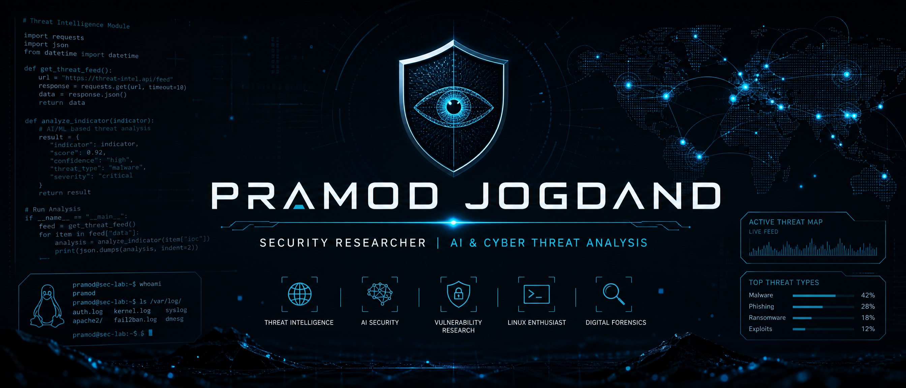

  

  

  
  
  
  
  
  
  

---

## 👋 About Me

* 🔐 **Focus:** Cybersecurity research, AI/LLM security, threat detection, MCP security, and defensive tooling.
* 🛠️ **Builder:** Creating open-source Python tools and research prototypes for practical cyber defense.
* 🧪 **Flagship work:** MCPSentinel, LLM Security Scanner, AI Threat Detector, and network-security tooling.
* 🏢 **Founder:** PremLabs Security, an independent AI-security and cybersecurity research lab.
* 📍 **Location:** Pune, Maharashtra, India

---

## 🛠️ Skills

### Core Technical Skills

  
  
  
  
  
  
  

### Research & Cybersecurity Domains

  
  
  
  
  

### Development & Platform Tools

  
  
  
  
  
  

---

## 🚀 Projects

* 🛡️ [MCPSentinel](https://github.com/PremLabs-Security/MCPSentinel) : Detects exposed or unauthenticated MCP endpoints and Ollama servers.
* 🧠 [LLM Security Scanner](https://github.com/PremLabs-Security/llm-security-scanner) : Scans prompts for injection, jailbreak, and other LLM-security risks.
* 🔍 [AI Threat Detector](https://github.com/PremLabs-Security/ai-threat-detector) : Research prototype for anomaly detection and threat classification.
* 🌐 [AI-Driven Attack Simulation](https://github.com/PremLabs-Security/ai-driven-attack-sim) : Defensive lab research for understanding AI-assisted attack patterns.
* 🛰️ [Network Recon Toolkit](https://github.com/Prem2868/network-recon-toolkit) : Network reconnaissance and security analysis toolkit.
* 🧪 [PremLabs Security](https://github.com/PremLabs-Security) : Open-source AI-security and cybersecurity research organization.

---

## 🏢 Organization & Research Lab

  
  
<i>Founder of PremLabs Security, building open-source AI-security and cybersecurity research tools with an emphasis on defensive use and responsible disclosure.</i>

---

## 📊 GitHub Stats

  
  
  

---

## 🏆 GitHub Trophies

  

---

## 📈 GitHub Activity Graph

  

---

## 🐍 GitHub Contribution Snake

  

---

  

